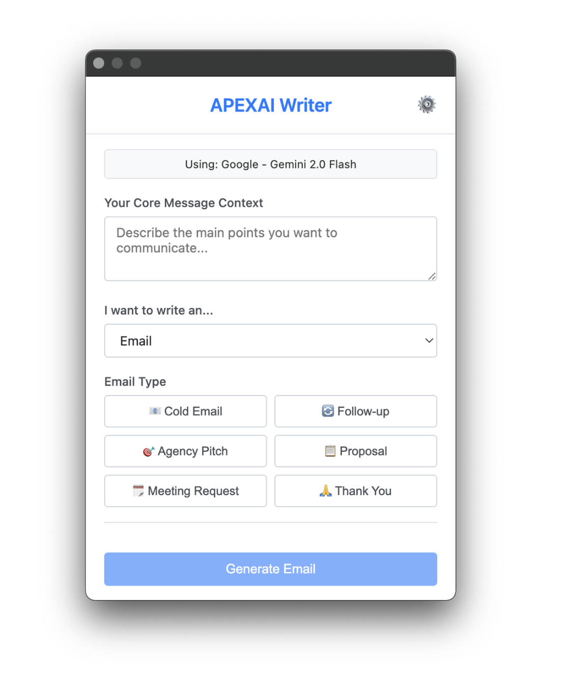

# APEXAI Writer Chrome Extension

Chrome extension that helps generate messages & emails. Specialized writing assistant for APEXAI personnel

## Usage

- download/clone this repository
- open [chrome://extensions/](chrome://extensions/) in your browser
- turn on the developer mode
- select `load unpacked` button
- Locate this directory

## Initial Configuration:

- After loading, the extension will open to the Settings page.
- Configure an LLM provider (OpenAI or Google), select a model, and enter your API key for that provider.
- Set your name in the settings, which will be used in prompts to indicate who is writing the message.

## Screenshots

