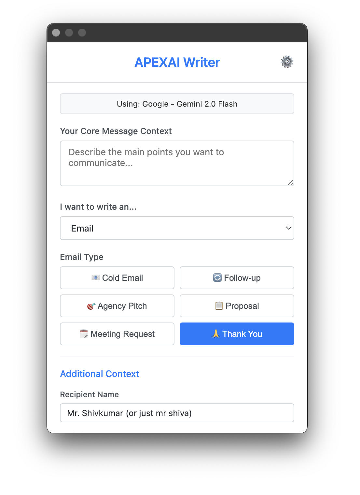
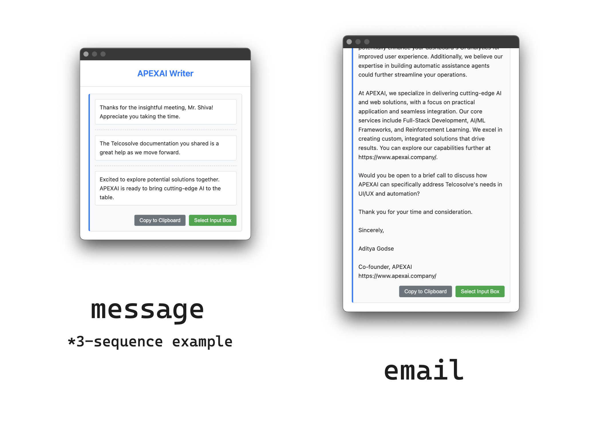

# APEXAI Writer Chrome Extension

Chrome extension that helps generate messages & emails. Specialized writing assistant for APEXAI personnel

## Usage

- download/clone this repository
- open [chrome://extensions/](chrome://extensions/) in your browser
- turn on the developer mode
- select `load unpacked` button
- Locate this directory

## Initial Configuration:

- After loading, the extension will open to the Settings page.
- Configure an LLM provider (OpenAI or Google), select a model, and enter your API key for that provider.
- Set your name in the settings, which will be used in prompts to indicate who is writing the message.

## Screenshots

---

Output:

## Security

We take the security of your data, especially your LLM API keys, very seriously. Here are the key measures implemented in the APEXAI Writer Chrome Extension to ensure your information is handled securely:

### API Key Protection

Your LLM API keys are sensitive credentials, and we've implemented robust measures to protect them:

1.  **Local Storage Only**: API keys (for OpenAI and Google) are stored exclusively on your local computer using `chrome.storage.local`. This storage is sandboxed and private to this extension, meaning other extensions or websites cannot directly access it.
2.  **Strong Encryption at Rest**: Before being saved to local storage, your API keys are encrypted using **AES-GCM 256-bit encryption**. This is a strong, authenticated encryption algorithm widely recognized for its security.
3.  **Secure Encryption Key Management**:
    - A unique, cryptographically strong master encryption key is generated by the extension the first time it's needed.
    - This master key is itself stored securely as a JSON Web Key (JWK) within `chrome.storage.local`, accessible only by this extension.
    - This master key is used solely for encrypting and decrypting your LLM API keys. Each API key (OpenAI, Google) is individually encrypted.
4.  **HTTPS Transmission**: When the extension communicates with your chosen LLM provider (OpenAI or Google), your API keys are transmitted over **HTTPS (TLS encrypted)** connections. This ensures that your keys are encrypted and protected while in transit between your browser and the LLM provider's servers.

### Minimal and Contextual Permissions

The extension is designed to operate with the minimum necessary permissions:

1.  **`storage`**: Required to save your settings and encrypted API keys locally.
2.  **`clipboardWrite`**: Used only when you explicitly click the "Copy to Clipboard" button.
3.  **`activeTab` & `scripting`**:
    - Instead of requesting broad access to all websites (e.g., `<all_urls>`), the extension uses the `activeTab` permission combined with `scripting`.
    - This means the extension can only interact with the content of the web page you are currently viewing _and only after_ you explicitly invoke a feature that requires it (like clicking the "Select Input Box" button to paste generated text).
    - This approach significantly enhances your privacy and security by limiting the extension's access to web content.

### Data Privacy & Handling

1.  **No External APEXAI Servers**: This extension operates entirely client-side within your browser. Your API keys, prompts, generated content, or any personal information like your name (used for prompts) are **never sent to, processed by, or stored on any APEXAI-owned servers or any third-party servers**, other than the LLM providers you directly configure (OpenAI or Google).
2.  **Local Settings**: All your preferences, including selected models, your name for prompts, and preferred message length, are stored locally alongside your encrypted API keys.
3.  **Fixed Company Information**: The APEXAI company information used to enrich prompts is embedded directly within the extension (`js/config.js`) and is not fetched from external sources, ensuring its integrity and consistency.

### Content Security Policy (CSP)

The extension's user interface (the popup window) operates under a strict **Content Security Policy** (`script-src 'self'; object-src 'self';`). This policy helps mitigate common web vulnerabilities like Cross-Site Scripting (XSS) by restricting where scripts and other resources can be loaded from, enhancing the security of the extension's own pages.

### Content Scripting

The content script (`js/content_script.js`), which enables pasting text into web pages, is:

- Only injected into a page when you explicitly activate the "Select Input Box" feature.
- Designed to carefully identify eligible input fields before pasting.
- The text pasted originates from the LLM via the extension's secure popup, not directly from potentially untrusted web page content.
